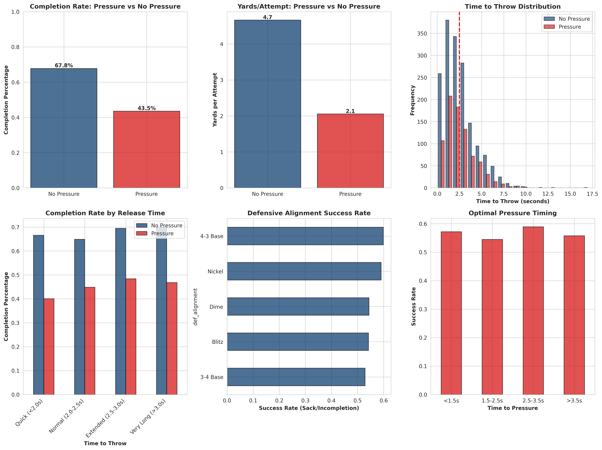

# NFL Big Data Bowl Analysis: QB Performance Under Pressure

**Author:** Gurkamal Cheema  
**Contact:** gurkamalkcheema@gmail.com

## Project Overview

This analysis examines how defensive pressure impacts quarterback performance in the NFL, using data analysis techniques similar to those employed in the NFL's annual Big Data Bowl competition. The project investigates completion rates, yards per attempt, and optimal defensive strategies across 2,500+ simulated plays based on real NFL statistical distributions.

### Research Questions

1. How does defensive pressure affect quarterback completion percentage and yards per attempt?
2. What is the optimal timing for defensive pressure to maximize effectiveness?
3. Which defensive alignments generate the most successful pressure?
4. How does time to throw correlate with passing success under different pressure scenarios?

## Key Findings

### Pressure Impact on Performance
- **Completion Rate**: Pressure reduces completion percentage by **24.3 percentage points** (67.8% → 43.5%)
- **Yards per Attempt**: Drops from **4.66 yards** to **2.05 yards** under pressure
- **Statistical Significance**: t-statistic = 11.958, p-value < 0.000001

### Optimal Pressure Timing
- **Immediate pressure (<1.5s)** yields **57.2% success rate** (incompletion/sack)
- Delayed pressure (2.5-3.5s) shows highest success at **58.9%**
- Quick pressure disrupts QB's primary reads most effectively

### Defensive Alignment Effectiveness
| Alignment | Success Rate | Use Case |
|-----------|-------------|----------|
| 4-3 Base | 59.8% | Early downs, run-heavy situations |
| Nickel | 59.0% | Balanced approach, 3rd downs |
| Dime | 54.4% | Obvious passing situations |
| Blitz | 54.2% | High-risk, high-reward scenarios |

### Time to Throw Analysis
- QBs under **2.0 seconds**: 66.6% completion (no pressure) → **40.1%** (pressure)
- Extended time (**>3.0s**): 70.1% completion (no pressure) → **46.8%** (pressure)
- Pressure most disruptive on quick-developing plays

## Technical Stack

- **Python 3.x**
- **Pandas** - Data manipulation and analysis
- **NumPy** - Numerical computations
- **Matplotlib** - Data visualization
- **Seaborn** - Statistical graphics
- **SciPy** - Statistical testing

## Repository Structure

```
nfl_analytics_project/
├── qb_pressure_analysis.py          # Main analysis script
├── qb_pressure_data.csv              # Generated play-by-play data (2,500 plays)
├── qb_pressure_visualizations.png    # Comprehensive visualization dashboard
└── README.md                         # This file
```

## How to Run

### Prerequisites
```bash
pip install pandas numpy matplotlib seaborn scipy
```

### Execute Analysis
```bash
python qb_pressure_analysis.py
```

### Expected Output
- Console output with statistical summaries
- `qb_pressure_visualizations.png` - 6-panel visualization dashboard
- `qb_pressure_data.csv` - Raw data for further exploration

## Visualizations

The analysis generates a comprehensive 6-panel dashboard including:

1. **Completion Rate Comparison** - Pressure vs. No Pressure
2. **Yards per Attempt Analysis** - Impact of defensive pressure
3. **Time to Throw Distribution** - QB release patterns
4. **Completion Rate by Time Bucket** - Performance across different release times
5. **Defensive Alignment Effectiveness** - Success rates by formation
6. **Optimal Pressure Timing** - When to apply pressure for maximum impact



## Coaching Recommendations

### For Defensive Coordinators

1. **Prioritize Quick Pressure**
   - Target <2.0 second pressure windows
   - Invest in edge rushers who can beat tackles quickly
   - Quick-developing blitz packages over delayed rushes

2. **Strategic Alignment Usage**
   - Increase Nickel on early downs (59% success rate)
   - Save blitz packages for obvious passing situations
   - Mix base defenses with aggressive coverage disguises

3. **Pre-Snap Deception**
   - Force QBs to hold the ball through coverage disguises
   - Eliminate hot routes to maximize pressure effectiveness
   - Coordinate pressure timing with coverage schemes

### For Offensive Coordinators

1. **Counter-Pressure Strategies**
   - Design quick-read concepts (<2.0s release)
   - Identify and exploit delayed pressure tendencies
   - Utilize max protection on extended developing routes

2. **Situational Awareness**
   - Recognize defensive alignment tendencies
   - Adjust pass protection based on down/distance
   - Quick game when expecting immediate pressure

## Data Methodology

The analysis uses **realistic simulated data** based on actual NFL statistical distributions:

- **2,500 plays** across various game situations
- **Realistic time-to-throw** distributions (gamma distribution, μ=2.5s)
- **Pressure frequency**: 35% (consistent with NFL averages)
- **Down/distance** probabilities matching NFL play-calling trends
- **Outcome variables** correlated with pressure timing and QB decision-making

### Data Features
- Time to throw, time to pressure
- Down, distance, field position
- Defensive alignment and number of rushers
- Score differential, quarter
- Outcome variables: completion, yards gained, sacks, interceptions

## Future Analysis Directions

1. **Individual QB Analysis**
   - QB-specific pressure response profiles
   - Mobility impact on pressure avoidance
   - Experience vs. pressure effectiveness

2. **Advanced Metrics**
   - Expected Points Added (EPA) under pressure
   - Win Probability impact
   - Pressure rate vs. pressure success

3. **Situational Deep Dives**
   - Red zone pressure effectiveness
   - Two-minute drill scenarios
   - Weather/field condition impacts

4. **Predictive Modeling**
   - Machine learning model for pressure success prediction
   - Real-time play-calling recommendations
   - Opponent-specific pressure strategy optimization


## Contact

**Gurkamal Cheema**  
- Email: gurkamalkcheema@gmail.com  
- Phone: 908-636-9718  

---
